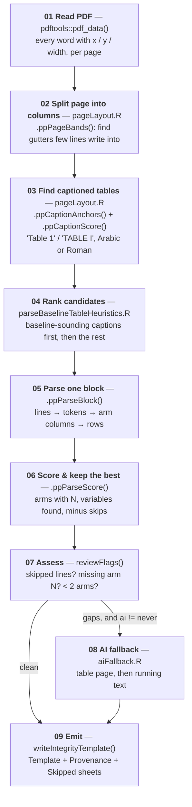

# The parse engine — Architecture

(Header refreshed 2026-08-26 by the repo audit: this document was
written when the parser was the separate ParsePDF package, folded into
IntegrityAnalysis 2026-08-17. The engine description below remains the
canonical map of the parsing internals; the packaging facts are now
these.)

The parse engine turns the baseline characteristics table ("Table 1")
of a randomized controlled trial PDF — and, since 2026-08-21, Word
manuscripts and journal-style spreadsheets — into one row per baseline
variable per treatment arm, in the input layout of the
[IntegrityAnalysis](https://github.com/StevenLShafer/IntegrityAnalysis)
Shiny app, which runs the Carlisle–Shafer Monte Carlo analysis of
baseline data.

| | |
|---|---|
| Language | R — developed on 4.5.3 (min declared ≥ 4.1) |
| Structure | part of the IntegrityAnalysis package (25 files in `R/`, explicit `Collate:`) |
| PDF layer | `pdftools` (poppler) word coordinates |
| AI layer | Anthropic Messages API over `httr2`, `claude-opus-5` |
| Output | `openxlsx` → Integrity-Analysis template |
| Costs money | **only** `R/aiFallback.R` — see [Where money is spent](#where-money-is-spent) |

## Who each engine is for

**The deterministic engine is the product; the AI fallback is a corpus-preparation
tool.** The deployed app will run with `ai = "never"`, because it may serve hundreds of users
and every fallback call is billed to the maintainer's Anthropic account — an unbounded cost he
cannot control. The AI paths exist so that a reference corpus can be built locally, and so that
the deterministic engine has something to be measured against.

That ordering should decide where effort goes: a fix to the deterministic engine reaches every
user, a better prompt reaches one person preparing data.

## The one invariant

**The deterministic engine always runs first, and its numbers always win. The AI fallback only
fills gaps, and never overwrites a value that was located on the page by coordinate.**

Everything else is negotiable; this is not. The package prepares data for research-fraud
investigation, so a reader must always be able to tell which numbers were found mechanically
and which were read by a language model. That is what `$provenance` and the spreadsheet's
Provenance sheet exist for.

| Engine | Entry point | Network | Costs money | Provenance tag |
|---|---|---|---|---|
| Deterministic | `parseBaselineTableHeuristics()` | none, ever | no | `heuristic` |
| AI, table page | `parseBaselineTableAI(source = "table")` | Messages API | **yes** | `ai` |
| AI, running text | `parseBaselineTableAI(source = "prose")` | Messages API | **yes** | `ai-prose` |
| Hybrid (default) | `parseBaselineTable()` | only when `reviewFlags()` fires | **sometimes** | mixed |
| Batch | `parseBaselineTableFiles()` | `ai = "never"` by default | **opt-in only** | mixed |

## The pipeline



Stages 01–07 are free and reproducible. Stage 08 is the only one that leaves the machine or
costs anything.

### 02 — Splitting the page into columns

This is the stage that made real articles parseable at all. Journals are typeset in two
columns, and a table usually sits in one of them with body prose beside it. Clustering words
into lines by `y` across the whole page width glues each table row onto a sentence of unrelated
prose:

```
achieved with neostigmine (0.05 mg·kg –1 ) and gly-   Age (yr)   70 ± 6   71 ± 5
```

`.ppPageBands()` measures, for each 1-point column of `x`, the fraction of text lines that write
into it, and calls a long low-coverage run a gutter. "Low" rather than "zero" matters: the
running head, the title and a full-width footnote all cross the gutter, so a strict emptiness
test finds nothing on a real page.

### 03–04 — Finding the right table

The engine does not pick a page and hope. It enumerates **every** captioned table in the
document, scores each caption for how much it sounds like a baseline table, and parses the most
promising ones.

- Captions are matched as **adjacent words** ("Table" + a numeral), not by a regex over joined
  line text — on a two-column page that joined text contains the other column's prose. Roman
  numerals are matched too; they are the house style of *Anaesthesia* and *CJA*.
- `.ppCaptionScore()` rewards "baseline", "demographic", *qualified* "characteristics", and the
  table being number 1; it penalises outcome vocabulary, unless the caption also says baseline.
- A cross-reference inside a sentence ("as demonstrated in Table 3 B and C") is demoted, not
  discarded — it is still tried if nothing better parses.
- **Typographic spaces are split at ingest** (2026-09-02). Springer sets "Table 1" + en space +
  thin space + caption, and poppler splits words only on ordinary spaces, so the token after
  "Table" arrived as `"1  Baseline"` — not a numeral — and no anchor matched: the real Table 1
  never became a candidate and the parser fell back on cross-reference mentions.
  `.ppSplitUnicodeSpaces()` (utils.R) splits such tokens on U+2000–U+200A, U+202F, U+205F and
  U+3000, apportioning the word box by character; NBSP is deliberately left alone, being a
  thousands separator in several journals.
- **A side caption is split from the header row it shares a line with** (2026-09-02). Springer
  prints the caption in a narrow margin column *left* of a full-width table, level with its
  header, so the caption line also held the arm names and an `(n = 99)`; `.ppParseBlock()` starts
  after the caption line, so that header — and arm 2's N — vanished, and every n (%) row was
  skipped for want of it. `.ppSplitSideCaption()` (pageLayout.R) fires only on a strict geometry:
  the anchor leads the line; a ≥ 25 pt gap follows a leading run spanning ≤ 30% of the band; no
  second caption sits right of the gap; and the body lines below start *right* of the caption
  column. That last test is what the corpus insisted on — without it the split fired on 207 of
  1,865 articles and regressed 13, because "Table 1 ‹wide gap› Patient characteristics" with the
  table running full width *under* it has the same gap. With it, measured on those 209 files:
  200 identical, 1 gained, 1 improved, 0 regressions.

### 04b — Repairing the font encoding

Before any of this can work, the text has to say what the page says. Some
journals embed fonts whose glyphs are mapped to the wrong Unicode points, so
poppler faithfully reports characters that are not what is printed.
Anesthesiology is the worst case: a printed `=` arrives as `U+2AFD` or
`U+2D1D`, and a printed `±` as `U+2AFE`. In those PDFs **the ASCII forms never
appear at all** — one article contained 204 mis-mapped plus-minus signs and
zero real ones.

The consequence is silent and total: `45 ⫾ 12` stops being a mean-and-SD cell
and becomes two unrelated numbers, and `(n ⫽ 20)` stops being an arm size. Both
are repaired in `.ppNormalizeGlyphs()` (`utils.R`), applied at the point of
reading by `.ppPdfData()` / `.ppPdfText()`. Every mapping in `.ppGlyphMap` was
read off surrounding context in the corpus — `U+2AFE` from "Data are presented
as mean ⫾ SD", `U+2D1D` from "20% mannitol (n ⴝ 20)" — never guessed, because a
wrong entry would corrupt numbers invisibly.

### 05 — Parsing one block

Within a candidate block: words cluster into lines by `y`; each line is tokenized into numeric
cells by one master regular expression; cell x-midpoints cluster into treatment-arm columns; a
p-value column is detected and dropped; arm names and N come from the header lines; and rows are
classified continuous vs categorical and expanded to one output line per arm.

Cell shapes recognised (`tokenize.R`):

| Token | Example | Meaning |
|---|---|---|
| `meanSD` | `45.3 ± 12.1` | continuous |
| `numParen` | `45.3 (12.1)` | mean (SD) **or** n (%) — disambiguated from footnotes and labels |
| `nPct` | `15 (60%)` | binary category |
| `fraction` | `15/10`, `12/8/5` | k-way category |
| `medianRng` | `127 [98–160]`, `127 [98, 160]` | median with Q1/Q3 **when the row label, caption, or footnote says the interval is an IQR** (issue 18; the app's metalog null accepts median/Q1/Q3 since issue 12); a stated range, or an unlabeled interval, is **skipped** — an IQR and a range both straddle the median, so only the text can tell them apart, and a fraud screen must not guess |
| `pctOnly` | `60%` | **skipped** — no count |
| `plain` | `45.3` | count under a category header, or an arm N |

`ROUND_MEAN` is read from the printed glyphs, never inferred from the value: `63` has 0 decimals
and `63.0` has 1. That distinction is data — it tells the Monte Carlo analysis how much of a
discrepancy rounding alone can explain.

### 05a — Word manuscripts (.docx, issue 19, 2026-08-21)

A `.docx` submission enters through `parseBaselineTableHeuristics()` like any file (the
`pdfFile` parameter name is historical; dispatch is by extension) and lands in
`R/parseDocx.R`. A Word table is already a grid of cells — `officer::docx_summary()` returns
the body in document order — so the docx path **fabricates the word-coordinate `lines`
structure and feeds `.ppParseBlock()` verbatim**: column *c*'s words sit at
`x = (c−1) × pitch`, with the pitch computed from the widest cell so `.ppClusterColumns()`
always sees each Word column as one cluster. Every cell rule above comes for free.

What differs from a PDF: captions pair exactly (the nearest preceding paragraphs, scored by
`.ppCaptionScore()` — caption-above-table is the engine's native orientation, and submissions
put tables at the end, which doesn't matter because every table in the document is a
candidate); footnotes are the paragraphs after the table, appended as synthetic lines so the
`stopPattern`/footnote machinery runs unchanged; arm-N recovery reads the paragraphs
(armNRecovery.R is pure text); no glyph repair is needed (officer returns real Unicode);
`pages` in the result is the table's ordinal, `layout` is `"docx"`, `engine` is
`"heuristic-docx"`. The AI fallback is refused for docx input (it renders PDF pages).

Officer quirks measured and handled: `doc_index` is unique per **cell**, and `row_id` runs on
across tables — tables are reassembled by `doc_index` continuity and rebased per table.
Punted: "Table 1 continued" split into a second Word table is not stitched; vertically merged
cells keep their text in the first row only. Security: a docx (zip + XML via libxml2) parses
as data and cannot execute, but crafted XML can stall its parser — the app routes docx through
`parseBaselineTableFiles()`'s subprocess-and-timeout exactly like a PDF.

### 05b — Submitted manuscripts (2026-08-20)

The deployed app screens **submissions, not published articles**, and submissions defeat
journal-tuned heuristics in their own ways. Screening 654 RCT submissions from the A&A
manuscript corpus found five, each now repaired and pinned as a synthetic fixture in
`test-manuscript-layouts.R`:

1. **Margin line-number rails.** Manuscripts number every line; those integers read as a column
   of bare numbers. `.ppStripLineNumberRail()` (pageLayout.R) removes a run of small ascending
   integers left of essentially all other text at the point of reading.
2. **Legend sentences between the caption and the table.** "Values are represented as mean ± SD
   or numbers (percentages)." used to trip the sustained-prose stop before any data was seen.
   Numberless lines are now tolerated until the first data line.
3. **Captions physically separated from their table** — a caption-list page, or a caption at the
   foot of the previous page. A caption with fewer than two data-looking lines beneath it now
   also queues a full-width *look-ahead candidate* for the following page, carrying the
   caption's score.
4. **Tables running over the page break** with no repeated caption. The winning full-width parse
   is extended onto following pages while they open with data-looking lines and the parse score
   improves.
5. **The gutter detector splitting a wide Word table** into a labels band and a values band. The
   values-only band used to win on parse score with nameless rows; the score now rewards
   demographic vocabulary in row labels and penalises "Unnamed" rows and implausibly many
   columns, so the full-width reading wins.

Two notation repairs came out of the same corpus: `mean±SD` written without spaces no longer
counts as evidence for the BJA dash-for-± rewrite (which was destroying every real `±` in the
document), and a block whose legend announces `mean - SD` with a plain hyphen has contiguous
`40.79-11.97` pairs re-read as mean ± SD — only on lines with at least two such pairs, so a lone
"(0–100 scale)" annotation cannot fabricate a value.

Measured on a seeded 60-submission random sample (deterministic engine only): template lines
475 → 1,116, mean/SD variables 95 → 254, arms with a known N 17 → 80. The same changes improved
the published-article corpus sample (n = 150): 102 → 117 articles yielding a table. What remains
out of deterministic reach on submissions: tables absent from the PDF (referenced but never
included in the build), percent-only tables with no counts, and fonts that drop the ± glyph so
mean and SD fuse into one number ("47.714.9") — splitting those would be fabrication, not
extraction.

### 08 — The AI fallback

Reached only when `reviewFlags()` is non-empty and `ai != "never"`. Two sources:

- `source = "table"` sends the text of **one page** — chosen by `.ppBestCaptionPage()`, the same
  caption machinery the deterministic engine uses.
- `source = "prose"` sends the **article text**, capped at `maxChars`, for trials that never
  tabulate their baseline data and state it in a sentence in the Methods.

Replies are constrained by a JSON schema (`.ppTableSchemaJson()`), so there is no free-text
parsing. Merging keeps every deterministic row and adds only variables the deterministic pass
never produced.

## Files

| File | Role |
|---|---|
| `R/parseBaselineTableHeuristics.R` | the deterministic engine; candidate enumeration, ranking, `.ppParseBlock()` |
| `R/pageLayout.R` | page bands, caption anchors and scoring, best-caption page, line building, column clustering |
| `R/tokenize.R` | one line of text → numeric cells |
| `R/utils.R` | decimals, numeric coercion, label cleaning, rbind-fill, the template column list |
| `R/parseBaselineTable.R` | hybrid entry point, `reviewFlags()`, `print.ParsePDFTable()` |
| `R/aiFallback.R` | **the only file that touches the network**; schema, prompts, request, response |
| `R/parseBaselineTableFiles.R` | batch runner, one subprocess per file |
| `R/writeIntegrityTemplate.R` | `.xlsx` writer |
| `inst/scripts/parseOne.R` | the subprocess worker the batch runner launches |

Files are flat in `R/` and load alphabetically. There is deliberately **no `Collate:` field** —
nothing evaluated at load time crosses files. Internal functions are prefixed `.pp`.

## The output contract

`res$data` must stay in the layout Integrity-Analysis `server.R` expects:

```
TRIAL | ROW | N | MEAN | SD | SE | ROUND_MEAN | ROUND_DISPERSION | ROUND_OBSERVATION | <one column per category...>
```

### Why SD and SE are separate columns

Papers print a standard deviation **or** a standard error, never a variance.
Converting one into the other is a **modelling decision, not an extraction
fact**, so the parser records whichever was printed and leaves the conversion to
the analysis. Three reasons this matters:

1. **Traceability.** Every number in `SD` or `SE` corresponds to a cell on the
   page. A converted value corresponds to nothing printed, which is a poor
   footing for an accusation of fraud.
2. **The bias correction belongs in one place.** The sample SD is a biased
   estimator of sigma by Jensen's inequality — about 1.8% low at n = 15, 5% at
   n = 6 — and a standard error inherits that bias. Integrity-Analysis already
   corrects it once, with `MBESS::s.u()` in `server.R`. If the parser also
   converted, whether the result is right would depend on what the parser
   silently did.
3. **It is a large error, not a rounding one.** At n = 15 a standard error is
   roughly a quarter of the standard deviation, so filing one as the other is
   wrong by a factor of four.

`ROUND_DISPERSION` is the printed granularity of whichever value was given. It
cannot be inferred from `ROUND_MEAN`: a table may print `39 (4.06)`.

Which it is, and whether the table actually said so, is recorded in
`res$dispersion` — `"sd (stated)"`, `"se (stated)"`, `"mixed (per row)"`, or
`"sd (assumed - table does not say)"` — and written to the Provenance sheet.
`reviewFlags()` reports both an SE and an assumption, because neither should
reach an analysis unnoticed.

> **Coupled to `server.R`.** `ROUND_DISPERSION` is numeric, integer-valued, and
> has `NA` on categorical rows — which is precisely `is_category()`'s test. It
> **must** appear in that function's list of known column names, as `ROUND_MEAN`
> and `ROUND_OBSERVATION` already do, or it will be analysed as a count of
> patients. `test-write-template.R` pins this so the two repositories cannot
> drift apart silently.

Two rules that app enforces:

- Categorical rows leave `N`/`MEAN`/`SD` as `NA` and put counts in the category columns; its
  `is_category` test is "integer-valued with at least one NA".
- Its column-name normalization is grep-based: any name containing `MEAN` that is not exactly
  `MEAN` becomes `ROUND_MEAN`, and any containing `OBS` becomes `ROUND_OBSERVATION`. **Never
  name a category column something matching those** — it will be silently swallowed.

`writeIntegrityTemplate()` writes the data to the **first** worksheet because the app reads
sheet 1; Provenance and Skipped go after it.

## How the Integrity-Analysis app will use this

The app's intended shape (Steve, 2026-08-16): a user supplies **one of four**
things — a path to a local PDF or a **folder** of PDFs, a single PDF, a
spreadsheet already in `Example.xlsx` format, or **nothing at all**. All four
converge on the same data frame, which is shown in an **editable grid**
(rhandsontable or similar), validated **cell by cell as it is entered**, and
only then submitted to the Monte Carlo — which runs **trial by trial, keyed by
the first column, with no cross-talk between trials**.

That end state settles several questions about this package:

| The app needs | This package offers |
|---|---|
| a folder of PDFs | `parseBaselineTableFiles()` — **use it, not a loop** |
| one PDF | `parseBaselineTable(ai = "never")` |
| a spreadsheet | nothing needed; imported directly |
| nothing | an empty frame with these columns |

Four things worth building around rather than discovering later:

1. **The grid is the answer to the arm-N gap.** About 58% of extracted rows
   carry no arm N. That is not a defect the parser can fully close — many
   tables simply never print it — and an editable, validated grid is exactly
   the right place to resolve it. Flag those cells; do not hide them.
2. **A folder upload must not loop in-process.** Roughly 2% of real PDFs hang
   poppler forever, and R cannot interrupt it. In a multi-user Shiny app an
   in-process hang takes the worker down for everyone.
   `parseBaselineTableFiles()` already forks per file with a timeout.
3. **Deployment runs `ai = "never"`** (see the section above), so expect ~72%
   of PDFs to yield a table and the user to correct the rest by hand. Design
   the grid for correction, not for display.
4. **Show one trial at a time.** Since the analysis has no cross-talk between
   trials, the grid never needs every trial at once — which sidesteps the
   category-column explosion (3,791 distinct category names across the corpus)
   that makes a single wide sheet unusable.

`$skipped` and `reviewFlags()` already say what the parser could not read and
why; those map directly onto cell-level flags in the grid, so the app can tell
the user *which* values need a human instead of asking them to check all of
them.

### The API, and why nothing may persist

The app will also expose an **API** for editorial systems (Editorial Manager
and the like) to call automatically and silently during peer review: the caller
sends a PDF or a spreadsheet, the service checks the resulting frame's
integrity, returns an error if it fails, and otherwise runs the Monte Carlo and
returns a CSV — **plus confirmation that the PDF has been deleted**. The
completed analysis is delivered as a spreadsheet, and Integrity-Analysis
retains no data.

Three consequences bear directly on this package:

1. **Nothing may be left on disk.** `pdftools::pdf_ocr_text()` and
   `pdf_ocr_data()` render every page to a `.png` **in the current working
   directory and leave it there** — full-page images of a submitted manuscript.
   `.ppOcrPages()` now renders into a temporary directory removed on exit, even
   when OCR throws. Any future code path that touches an uploaded file needs
   the same discipline, and it is worth testing for rather than assuming (see
   `test-utils.R`).
2. **Peer review is a second, stronger reason to keep AI out of deployment.**
   The cost argument is decisive on its own, but manuscripts under review are
   *unpublished*: sending one to a third-party API is a confidentiality problem
   as well as an expense. The deterministic engine also gives the API something
   an AI path cannot — the same submission always yields the same verdict,
   which matters when the output may influence an editorial decision.
3. **A silent caller cannot correct anything**, so the API must refuse rather
   than guess. `reviewFlags()` is the natural gate, and a missing arm N is a
   hard failure by decision: without a hard-coded N the service returns a fail
   rather than running the Monte Carlo. About 58% of parsed rows lack one.

**A failure returns the table, not just an error.** A failed PDF scan hands
back whatever was extracted, so an editor or reviewer can fill the gaps and
call the API again with a spreadsheet instead of the PDF. That turns a failed
scan into a round trip, and it imposes one requirement on this package worth
stating plainly:

> **The failure payload must itself be valid input to the next call.**

Which it already is — `writeIntegrityTemplate()` writes the Template sheet in
the app's own input layout, so a returned partial table can be edited and
resubmitted without translation. Two details to preserve when building the API:

- Keep the annotation *out of the data columns*. Provenance and Skipped are
  separate worksheets for this reason, and any "needs attention" marker should
  be a text column or a separate sheet — never something numeric, which
  `server.R` would read as a category (its test is "integer-valued with at
  least one NA").
- `$skipped` names each row that could not be used **and why** ("median
  \[range\] - the analysis needs quartiles (Q1/Q3), not the range"). That is
  what tells the editor where to look, and it is more useful to return than a
  count of failures.

## Where money is spent

Everything in this package is free except calls to the Anthropic Messages API, which are billed
to the Console account whose key is in `ANTHROPIC_API_KEY`. There is exactly one file that can
spend money — `R/aiFallback.R` — and these are the ways to reach it:

| Call | Spends? | Measured cost |
|---|---|---|
| `parseBaselineTableHeuristics(...)` | never | — |
| `parseBaselineTable(..., ai = "never")` | never | — |
| `parseBaselineTable(...)` (default `ai = "fallback"`) | only if `reviewFlags()` is non-empty **and** a key is set | ~$0.055–0.11 per article reached |
| `parseBaselineTable(..., ai = "always")` | **every call** | ~$0.055 per article |
| `parseBaselineTableAI(..., source = "table")` | **every call** | ~$0.055 per article (one page) |
| `parseBaselineTableAI(..., source = "prose")` | **every call** | ~$0.11 per article (whole text, capped by `maxChars`) |
| `parseBaselineTableFiles(...)` | **not by default** (`ai = "never"`) | — |
| `parseBaselineTableFiles(..., ai = "fallback")` | up to one call **per file** | a 1,865-file corpus could exceed **$100** |

Guards already in place:

- With no key, the hybrid returns the deterministic result and its flags rather than erroring —
  it never silently blocks or fails on a missing key.
- `parseBaselineTableFiles()` defaults to `ai = "never"` precisely because a directory can hold
  thousands of articles, and it reports how many files may be sent before any call is made.
- `maxTokens` caps the reply and `maxChars` caps the prose request.

Prices used above: `claude-opus-5` at $5 per million input tokens and $25 per million output,
measured over 31 real articles. **Check current pricing** — these are list prices at the time of
writing, and thinking tokens are billed as output.

Two habits worth keeping:

1. **Page selection is deterministic and free.** Before spending on a batch, check what
   `.ppBestCaptionPage()` chooses. Sending the model the wrong page produces a confident "there
   is no table here" and you pay for it anyway.
2. **Auto-reload on the Console account means a runaway loop bills silently.** Scope any corpus
   run with a small `head()` first.

## Validation

Scored against John Carlisle's hand-extracted values (`One Sheet Carlisle Data.xlsx`) by
comparing the multiset of `(mean, SD)` pairs per PMID, so neither side's naming or arm order
matters.

**Carlisle's file is a guide, not an oracle** — it was compiled by hand and contains its own
errors, so a disagreement is a question to investigate rather than proof of a bug on our side.
Discrepancies that survive investigation need Steve to adjudicate against the paper. Do not tune
the parser to maximise agreement with it.

**The whole corpus has now been run**, deterministically, twice — once before the font repairs
and once after.

| Measure | Before repairs | After repairs |
|---|---|---|
| Articles yielding a table | 1,329 / 1,865 (71%) | 1,341 / 1,865 (72%) |
| Trials with at least one mean/SD | 721 | **911** |
| Continuous rows extracted | 9,344 | **12,654** |
| Known pairs recovered (806 scored trials) | 3,359 / 6,965 (48%) | **5,655 / 9,749 (58%)** |
| Trials fully recovered | 253 | **372** |
| Rows carrying an arm N | 2,392 (26%) | **5,264 (42%)** |

Per journal, the repairs land where the broken fonts were:

| Journal | n | Usable before | Usable after |
|---|---|---|---|
| Anesthesiology | 357 | 31% | **75%** |
| EJA | 444 | 12% | **21%** |
| CJA | 247 | 74% | 74% |
| Anaesthesia | 288 | 48% | 48% |
| BJA | 529 | 41% | **39%** |

BJA going *down* is the point, not a regression: the plus-minus guard removes rows that were
being fabricated out of printed ranges.

The AI fallbacks, measured on exactly the articles the deterministic engine scores zero on:
prose 100/110 (91%) over 10 articles, table 205/254 (81%) over 21.

The AI figures are measured on exactly the articles the deterministic engine scores **zero** on,
so they are what the fallback rescues, not a rerun of what already worked.

## Keeping this map current

Update **both** this file and `architecture.html` when any of the following changes: the engine
table or its invariant, the pipeline stages, the file list, the output contract, or anything in
[Where money is spent](#where-money-is-spent). The cost table is the part most likely to go
stale and the most consequential when it does.
