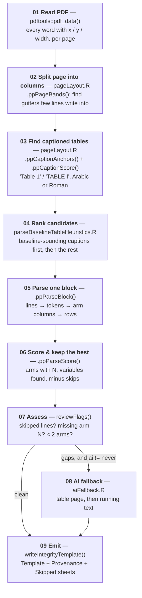

# The parse engine — Architecture

**This is the August 2026 design record of the parser, kept as history.**
It was written when the parser was the separate ParsePDF package (folded
into IntegrityAnalysis 2026-08-17; header refreshed 2026-08-26 and
2026-09-06). The engine description — pipeline, invariant, tokens,
output contract — still maps the internals, but the as-built parser
differs from the design in several places, and where the text below
said something that is no longer true it has been corrected in place
and marked *(as built)*: the deployed app and the REST API do run the AI
fallback, under the user's own key; a JATS XML route exists; the file
list has grown; `DESCRIPTION` has a `Collate:` field. What the software
does today is documented in `docs/user-guide.md`, `docs/api-spec.md` and
`docs/data-handling.md`; what changed in the statistics, and when, is in
`docs/method-history.md`.

The parse engine turns the baseline characteristics table ("Table 1")
of a randomized controlled trial PDF — and, since 2026-08-21, Word
manuscripts and journal-style spreadsheets; since 2026-08-30 JATS XML
articles (`R/parseJats.R`); since 2026-09-02 pictures of tables — into
one row per baseline
variable per treatment arm, in the input layout of the
[IntegrityAnalysis](https://github.com/StevenLShafer/IntegrityAnalysis)
Shiny app, which runs the Carlisle–Shafer Monte Carlo analysis of
baseline data.

| | |
|---|---|
| Language | R — developed on 4.5.3 (min declared ≥ 4.1) |
| Structure | part of the IntegrityAnalysis package (29 files in `R/`, explicit `Collate:`) |
| PDF layer | `pdftools` (poppler) word coordinates |
| AI layer | Anthropic Messages API over `httr2`, `claude-opus-5` |
| Output | `openxlsx` → Integrity-Analysis template |
| Costs money | **only** `R/aiFallback.R` — see [Where money is spent](#where-money-is-spent) |

## Who each engine is for

**The deterministic engine is the product; the AI fallback is a corpus-preparation
tool.** The design ran the deployed app with `ai = "never"`, because it may serve hundreds of users
and every fallback call would be billed to the maintainer's Anthropic account — an unbounded cost he
cannot control. The AI paths exist so that a reference corpus can be built locally, and so that
the deterministic engine has something to be measured against.

*(As built, ISSUES.md issue 8.)* The cost objection was answered by **bring your own key**: the
deployed app runs `ai = "never"` until the user enters their own Anthropic key, and then
`ai = "fallback"` for that session (`R/app_server.R`, capped at 25 documents per session), and the
REST API does the same per request when the caller sends an `X-Anthropic-Key` header
(`R/apiService.R`). The maintainer's account is never billed; the deterministic-first invariant
below is unchanged.

That ordering should decide where effort goes: a fix to the deterministic engine reaches every
user, a better prompt reaches one person preparing data.

## The one invariant

**The deterministic engine always runs first, and its numbers always win. The AI fallback only
fills gaps, and never overwrites a value that was located on the page by coordinate.**

Everything else is negotiable; this is not. The package prepares data for research-fraud
investigation, so a reader must always be able to tell which numbers were found mechanically
and which were read by a language model. That is what `$provenance` and the spreadsheet's
Provenance sheet exist for.

| Engine | Entry point | Network | Costs money | Provenance tag |
|---|---|---|---|---|
| Deterministic | `parseBaselineTableHeuristics()` | none, ever | no | `heuristic` |
| AI, table page | `parseBaselineTableAI(source = "table")` | Messages API | **yes** | `ai` |
| AI, running text | `parseBaselineTableAI(source = "prose")` | Messages API | **yes** | `ai-prose` |
| Hybrid (default) | `parseBaselineTable()` | only when `reviewFlags()` fires | **sometimes** | mixed |
| Batch | `parseBaselineTableFiles()` | `ai = "never"` by default | **opt-in only** | mixed |

## The pipeline



Stages 01–07 are free and reproducible. Stage 08 is the only one that leaves the machine or
costs anything.

### 02 — Splitting the page into columns

This is the stage that made real articles parseable at all. Journals are typeset in two
columns, and a table usually sits in one of them with body prose beside it. Clustering words
into lines by `y` across the whole page width glues each table row onto a sentence of unrelated
prose:

```
achieved with neostigmine (0.05 mg·kg –1 ) and gly-   Age (yr)   70 ± 6   71 ± 5
```

`.ppPageBands()` measures, for each 1-point column of `x`, the fraction of text lines that write
into it, and calls a long low-coverage run a gutter. "Low" rather than "zero" matters: the
running head, the title and a full-width footnote all cross the gutter, so a strict emptiness
test finds nothing on a real page.

- **A narrow gutter** (2026-09-25, issue 57): a run of at least eight points that no line of
  the page crosses is a column boundary too; the twelve-point rule with its 8% tolerance stands
  for gutters a few lines cross.

### 03–04 — Finding the right table

The engine does not pick a page and hope. It enumerates **every** captioned table in the
document, scores each caption for how much it sounds like a baseline table, and parses the most
promising ones.

> **The engine returns ONE baseline table, and that is a contract, not an accident.** It selects
> a single winning table; it never merges two. A manuscript that divides its baseline data across
> several tables — demographics in Table 1, comorbidities in Table 2, operative details in
> Table 3 — yields whichever one scored highest, silently, with no signal that the others held
> baseline data too.
>
> Merging them is not a scoring problem. It would require deciding that several tables describe
> **the same arms in the same column order**, which nothing in the document guarantees: arm
> counts differ between tables, column order differs, and a mis-alignment would silently pair one
> arm's mean with another arm's N — producing a confident verdict from data that was never in the
> paper. That failure is worse than extracting one table and saying so.
>
> The documented route for a split baseline table is transcription into a single spreadsheet,
> where the user asserts the arm alignment rather than the engine guessing it. See the user guide,
> *An article PDF*. (Steve's ALN-D-26-01239 review, 2026-09-23.)

- Captions are matched as **adjacent words** ("Table" + a numeral), not by a regex over joined
  line text — on a two-column page that joined text contains the other column's prose. Roman
  numerals are matched too; they are the house style of *Anaesthesia* and *CJA*.
- **An unnumbered caption is matched too** (2026-09-25, issue 39). A paper with a single table
  may print it as "TABLE Demographic data" (*CJA* 1997 and 2003, the Saitoh papers of the
  Loadsman corpus), and requiring a numeral lost the whole table. A bare "TABLE" or "Table"
  followed by a Capitalised word is an anchor, provided it *starts its block* (the gap to its
  left is the only evidence that the word is a caption at all); a lower-case "table" in a
  sentence and "Table shows" are not. `.ppCaptionStart()` is the one place that asks whether a
  line begins a caption — numbered or not — for the block walker, the continuation-page
  extender and the Table Transformer adapter.
- `.ppCaptionScore()` rewards "baseline", "demographic", *qualified* "characteristics", and the
  table being number 1 (switched on 2026-09-25, issue 40, after a before/after misparse run:
  435 → 444 fully corroborated files; an unnumbered caption counts as a first table too); it
  penalises outcome vocabulary, unless the caption also says baseline.
- A cross-reference inside a sentence ("as demonstrated in Table 3 B and C") is demoted, not
  discarded — it is still tried if nothing better parses.
- **Typographic spaces are split at ingest** (2026-09-02). Springer sets "Table 1" + en space +
  thin space + caption, and poppler splits words only on ordinary spaces, so the token after
  "Table" arrived as `"1  Baseline"` — not a numeral — and no anchor matched: the real Table 1
  never became a candidate and the parser fell back on cross-reference mentions.
  `.ppSplitUnicodeSpaces()` (utils.R) splits such tokens on U+2000–U+200A, U+202F, U+205F and
  U+3000, apportioning the word box by character; NBSP is deliberately left alone, being a
  thousands separator in several journals.
- **A side caption is split from the header row it shares a line with** (2026-09-02). Springer
  prints the caption in a narrow margin column *left* of a full-width table, level with its
  header, so the caption line also held the arm names and an `(n = 99)`; `.ppParseBlock()` starts
  after the caption line, so that header — and arm 2's N — vanished, and every n (%) row was
  skipped for want of it. `.ppSplitSideCaption()` (pageLayout.R) fires only on a strict geometry:
  the anchor leads the line; a ≥ 25 pt gap follows a leading run spanning ≤ 30% of the band; no
  second caption sits right of the gap; and the body lines below start *right* of the caption
  column. That last test is what the corpus insisted on — without it the split fired on 207 of
  1,865 articles and regressed 13, because "Table 1 ‹wide gap› Patient characteristics" with the
  table running full width *under* it has the same gap. With it, measured on those 209 files:
  200 identical, 1 gained, 1 improved, 0 regressions.

### 04b — Repairing the font encoding

Before any of this can work, the text has to say what the page says. Some
journals embed fonts whose glyphs are mapped to the wrong Unicode points, so
poppler faithfully reports characters that are not what is printed.
Anesthesiology is the worst case: a printed `=` arrives as `U+2AFD` or
`U+2D1D`, and a printed `±` as `U+2AFE`. In those PDFs **the ASCII forms never
appear at all** — one article contained 204 mis-mapped plus-minus signs and
zero real ones.

The consequence is silent and total: `45 ⫾ 12` stops being a mean-and-SD cell
and becomes two unrelated numbers, and `(n ⫽ 20)` stops being an arm size. Both
are repaired in `.ppNormalizeGlyphs()` (`utils.R`), applied at the point of
reading by `.ppPdfData()` / `.ppPdfText()`. Every mapping in `.ppGlyphMap` was
read off surrounding context in the corpus — `U+2AFE` from "Data are presented
as mean ⫾ SD", `U+2D1D` from "20% mannitol (n ⴝ 20)" — never guessed, because a
wrong entry would corrupt numbers invisibly.

- **Three more plus-minus spellings** (2026-09-25, issue 45). A bullet between two numbers
  ("56.7 • 6.9", the OCR of a scanned CJA page) tokenizes as mean ± SD. Two announced
  notations join the "mean − SD" dash re-read: "mean + SD" (a pair of plain numbers separated
  only by "+" is one cell; read unannounced too on a line that already holds two mean ± SD
  cells), and "mean2SD" (Acta 1997's font maps the glyph to the digit 2, so "49.527.9" is one
  token: it is split at the 2 that leaves both halves with equal decimals, and only when exactly
  one split qualifies). A data line whose numbers are 1..k each behind the same word ("Group 1
  Group 2 Group 3 Group 4") is the arm-name line; a caption whose anchor line is the bare
  "Table 1" takes the numberless line beneath as its title.
- **Arm N from a fraction row** (2026-09-25, issue 41). When the header printed no arm size
  at all, an arm whose every "a/b" fraction cell (sex, ASA class) sums to one value takes it as
  its N, with the source recorded; fractions that disagree leave N unknown.

- **What OCR leaves under a scanned table** (2026-09-25, issue 46). A column fed only by
  lines that carry no row label is not an arm column and is dropped after clustering (a
  figure's axis ticks under CJA 1995's Table I had seeded three); the prose fence (more words
  than three per column) applies to every label line that would name the arms; counts with no
  level name under a heading are skipped, not filed as "Category"; a label line holding a "|"
  never opens a heading.

### 05 — Parsing one block

Within a candidate block: words cluster into lines by `y`; each line is tokenized into numeric
cells by one master regular expression; cell x-midpoints cluster into treatment-arm columns; a
p-value column is detected and dropped; arm names and N come from the header lines; and rows are
classified continuous vs categorical and expanded to one output line per arm.

Cell shapes recognised (`tokenize.R`):

| Token | Example | Meaning |
|---|---|---|
| `meanSD` | `45.3 ± 12.1` | continuous |
| `numParen` | `45.3 (12.1)` | mean (SD) **or** n (%) — disambiguated from footnotes and labels |
| `nPct` | `15 (60%)` | binary category |
| `fraction` | `15/10`, `12/8/5` | k-way category |
| `medianRng` | `127 [98–160]`, `127 [98, 160]` | median with Q1/Q3 **when the row label, caption, or footnote says the interval is an IQR** (issue 18; the app's metalog null accepts median/Q1/Q3 since issue 12); a stated range, or an unlabeled interval, is **skipped** — an IQR and a range both straddle the median, so only the text can tell them apart, and a fraud screen must not guess |
| `pctOnly` | `60%` | **skipped** — no count |
| `plain` | `45.3` | count under a category header, or an arm N |

`ROUND_MEAN` is read from the printed glyphs, never inferred from the value: `63` has 0 decimals
and `63.0` has 1. That distinction is data — it tells the Monte Carlo analysis how much of a
discrepancy rounding alone can explain.

- **A row's own "(n = k)" line** (2026-09-25, issue 47). A "(n = k)" line printed directly
  under a continuous row's cells is that row's N, arm by arm (Fujii 2002's "Last menstrual
  cycle" row, measured on 12/13/12/12 of the arms' 20); the merge then recognises the model's
  reading of that row by its values.
- **The N row's label** (2026-09-25, issue 48): "n", "N", "No.", "Number", or "No./Number of"
  + a group noun (patients … volunteers). An arm with an N but neither a name nor a cell is
  dropped at assembly as a phantom, beside the label-column clusters that always were.

- **Levels across the line** (2026-09-25, issue 49). "Age (years): 20–30 31-40  78 (47.6%)
  86 (52.4%) …" prints a categorical variable on one line: level names after the colon, then
  m cells per arm. When the header states k arms and the line holds m × k n (%) cells with m
  level names, the cells feed no column and the row is emitted arm by arm (cell i to arm
  ⌈i/m⌉), with the level names as its category columns.

- **Ordinal arm names with trailing column words, and CONSORT sizes** (2026-09-25, issue 50).
  "Group 1 Group 2 Group 3 ANOVA test p value" is the arm-name line (the run of "word number"
  pairs from the start decides); a flow diagram's "Analyzed (n=30)" mentions fill the arms when,
  screening boxes and totals set aside, every remaining mention states one n and k × n is the
  stated total ("Randomized (n=90)" counts as one); the ladder sees only arms that carry value
  cells, so a statistic column is never an arm.

- **Numeric arm names** (2026-09-25, issue 56). "Group 60 50 40 30 20 Volunteers" above the
  first value line is the arm-name line; its numbers name the arms as printed.
- **Strata** (2026-09-25, issue 55). A labelled "(n = k)" line inside the table ("Young
  patients (n = 75) (n = 25) (n = 25) (n = 25)") opens a stratum: the rows beneath carry its
  arm sizes and its name as a prefix ("Young patients: Age, y"); a bare "(n = k)" line is the
  row above's own n (issue 47); a footnote marker never opens a heading.

### 05a — Word manuscripts (.docx, issue 19, 2026-08-21)

A `.docx` submission enters through `parseBaselineTableHeuristics()` like any file (the
`pdfFile` parameter name is historical; dispatch is by extension) and lands in
`R/parseDocx.R`. A Word table is already a grid of cells — `officer::docx_summary()` returns
the body in document order — so the docx path **fabricates the word-coordinate `lines`
structure and feeds `.ppParseBlock()` verbatim**: column *c*'s words sit at
`x = (c−1) × pitch`, with the pitch computed from the widest cell so `.ppClusterColumns()`
always sees each Word column as one cluster. Every cell rule above comes for free.

What differs from a PDF: captions pair exactly (the nearest preceding paragraphs, scored by
`.ppCaptionScore()` — caption-above-table is the engine's native orientation, and submissions
put tables at the end, which doesn't matter because every table in the document is a
candidate); footnotes are the paragraphs after the table, appended as synthetic lines so the
`stopPattern`/footnote machinery runs unchanged; arm-N recovery reads the paragraphs
(armNRecovery.R is pure text); no glyph repair is needed (officer returns real Unicode);
`pages` in the result is the table's ordinal, `layout` is `"docx"`, `engine` is
`"heuristic-docx"`. The AI fallback is refused for docx input (it renders PDF pages) — and, as
built, for JATS `.xml` input for the same reason (`parseBaselineTable()` drops to `ai = "never"`
for both extensions with a note).

Officer quirks measured and handled: `doc_index` is unique per **cell**, and `row_id` runs on
across tables — tables are reassembled by `doc_index` continuity and rebased per table.
Punted: "Table 1 continued" split into a second Word table is not stitched; vertically merged
cells keep their text in the first row only. Security: a docx (zip + XML via libxml2) parses
as data and cannot execute, but crafted XML can stall its parser — the app routes docx through
`parseBaselineTableFiles()`'s subprocess-and-timeout exactly like a PDF.

### 05b — Submitted manuscripts (2026-08-20)

The deployed app screens **submissions, not published articles**, and submissions defeat
journal-tuned heuristics in their own ways. Screening 654 RCT submissions from the A&A
manuscript corpus found five, each now repaired and pinned as a synthetic fixture in
`test-manuscript-layouts.R`:

1. **Margin line-number rails.** Manuscripts number every line; those integers read as a column
   of bare numbers. `.ppStripLineNumberRail()` (pageLayout.R) removes a run of small ascending
   integers left of essentially all other text at the point of reading.
2. **Legend sentences between the caption and the table.** "Values are represented as mean ± SD
   or numbers (percentages)." used to trip the sustained-prose stop before any data was seen.
   Numberless lines are now tolerated until the first data line.
3. **Captions physically separated from their table** — a caption-list page, or a caption at the
   foot of the previous page. A caption with fewer than two data-looking lines beneath it now
   also queues a full-width *look-ahead candidate* for the following page, carrying the
   caption's score.
4. **Tables running over the page break** with no repeated caption. The winning full-width parse
   is extended onto following pages while they open with data-looking lines and the parse score
   improves.
5. **The gutter detector splitting a wide Word table** into a labels band and a values band. The
   values-only band used to win on parse score with nameless rows; the score now rewards
   demographic vocabulary in row labels and penalises "Unnamed" rows and implausibly many
   columns, so the full-width reading wins.

Two notation repairs came out of the same corpus: `mean±SD` written without spaces no longer
counts as evidence for the BJA dash-for-± rewrite (which was destroying every real `±` in the
document), and a block whose legend announces `mean - SD` with a plain hyphen has contiguous
`40.79-11.97` pairs re-read as mean ± SD — only on lines with at least two such pairs, so a lone
"(0–100 scale)" annotation cannot fabricate a value.

Measured on a seeded 60-submission random sample (deterministic engine only): template lines
475 → 1,116, mean/SD variables 95 → 254, arms with a known N 17 → 80. The same changes improved
the published-article corpus sample (n = 150): 102 → 117 articles yielding a table. What remains
out of deterministic reach on submissions: tables absent from the PDF (referenced but never
included in the build), percent-only tables with no counts, and fonts that drop the ± glyph so
mean and SD fuse into one number ("47.714.9") — splitting those would be fabrication, not
extraction.

### 05c — Pictures of tables (jpg/png/tif, 2026-09-02)

A screenshot or scan of Table 1 enters through `parseBaselineTableHeuristics()` like any file
and takes the scanned-page road of issue 22, tier 2: tesseract word boxes into this same engine,
`engine = "heuristic-ocr"`, `"ocr"` provenance on every row, whole-table cyan in the app. Two
things differ from a scanned PDF page:

- **Scale.** The engine's tolerances are in PDF points; an image carries no trustworthy dpi.
  Measured on a journal page rendered at 300, 150 and 96 dpi, the median confident OCR word box
  was 6.72 pt at every resolution, so `.ppImageData()` scales each image so that its median word
  box lands at `.ppImageWordPt` (6.75 pt). A 150-dpi and a 300-dpi render of one page land on
  the same coordinates, and the suite pins that.
- **The header is read first, by us.** `.ppImageDims()` parses dimensions, page count and
  format from the magic bytes with no decoder involved, and `.ppImageOK()` refuses anything over
  20 megapixels, over 10 TIFF pages, a looping directory chain, or not a JPEG/PNG/TIFF whatever
  the file is called. Only then does tesseract's own reader (leptonica — never ImageMagick)
  decode it, inside the parse subprocess. GIF is refused by design: its header cannot bound its
  decoder. A JPEG or PNG can take the AI route as an image block of its own type; a TIFF stays
  with local OCR.

Quality is what tesseract gives: a clean 300-dpi render reproduces the text-layer parse exactly
(pinned for all three formats); at 96 dpi words begin to drop. `test-image-uploads.R` holds the
header, bomb, scale and route tests; the security screen that adjudicated the feature is
recorded in `docs/security-screens/log.md`.

### 05d — Table Transformer geometry, with tesseract on scanned pages (2026-09-02)

The third route into `.ppParseBlock()`, beside the text-layer engine and the Word path. Microsoft's
Table Transformer (`python/tatr/tatrTables.py`, pegged weights and libraries, run as a subprocess)
finds a table's rows and columns on the rendered page and writes them as `*.tatr.xml`. On a page
with a text layer the XML already carries each cell's text; on a page with none, the R side
(`R/parseTatr.R`) reads the page with tesseract and assigns each OCR word to the cell holding at
least half of its box — the same rule the Python side applies to text-layer words — in reading
order by line. Either way the cell grid then goes through the **same `.ppDocxLines()` adapter the
Word path uses**, so every cell rule applies unchanged.

- **The model never chooses the table.** It claimed a baseline table in a third of the articles
  that have none, so every table it found is a candidate and the engine's own caption and parse
  scoring pick the winner, exactly as for a `.docx`. The caption is the best-scoring "Table N"
  line above the detection box (or level with it), and up to four lines beneath the box travel
  as footnotes, so the stop-pattern and "a (b)" machinery see what they see for a PDF block.
- **A rescue tier.** `parseBaselineTable(tatr = "auto")` tries the seam when the text engine
  fails, before the AI route; on image-only pages it runs ahead of plain OCR (arm 1 of the OCR
  measurement found plain OCR's dominant failure to be the *wrong table*, which is precisely
  what geometry fixes); `tatr = "always"` also compares it against a successful text parse by
  parse score. Engines: `heuristic-tatr` (text layer) and `heuristic-tatr-ocr` (the pairing —
  `"ocr"` provenance, whole-table cyan in the app).
- **Where it runs.** The model needs the pegged Python (`tools/tatrProvision.sh`; the Linux
  nodes; a Docker image with `INTEGRITY_TATR_PYTHON` set). Where it is absent — shinyapps.io —
  the seam is inert and the parser behaves exactly as before. The runner is the package's second
  subprocess launcher, reviewed and pinned in `tools/securityCheck.R` group 1: fixed interpreter
  and script, every argument quoted, offline, OS timeout, output read as XML data.
- **Measured** (2026-09-02, installed snapshot, PR #147). Text layer: of 574 Carlisle articles
  with model geometry the engine alone parses 523, and of the 51 it cannot the seam recovers
  25 (8 with an N on every arm, 17 with continuous rows). Scanned set: of 192 with geometry the
  engine alone parses 106; the seam recovers 19 of the 86 failures through the text layer, but
  the OCR pairing on real scans yielded only fragments (18 results, none with two arm Ns) and
  is gated on arm identity like the OCR rescue. So the geometry earns its place on text-layer
  failures; on a real scan the AI image route remains the quality path (issue 22).

`tests/testthat/test-tatr.R` hand-builds the XML the model would write for the synthetic PDFs
and pins: geometry + text layer reproduces the text-layer parse exactly; geometry + tesseract
reproduces it with no text layer at all; the workflow falls back, stays out of the way, and is
inert without the model.

### 08 — The AI fallback

- **Model-added outcomes are refused** (2026-09-25, issue 54). A variable the model adds to
  the deterministic baseline table whose label names an outcome (time to, VAS, follow-up
  week/month, nausea, hypotension, duration of surgery, ephedrine …) goes to `$skipped` with
  its reason and a flag, never into the analysis; the model's reply is not reproducible, and a
  run may read every table on the page.
- **A model count (%) row is filed as a category** (2026-09-25, issue 53). A "continuous" row
  from the model whose "sd" is each arm's count as a percentage of the arm's N (whole-number
  count, "sd" within 0–100, one-decimal rounding) is n (%) and becomes a count with its
  complement; "score", "index" and "ratio" labels are left as read.
- **A variable short of arms consults the model** (2026-09-25, issue 51). `reviewFlags()` names
  every continuous variable with fewer cells than the table has arms; the flag gates the
  consult, the arm-by-arm merge fills the cells from the model's reading, and a table so
  completed reports itself as "hybrid" with the model's notes and reply.
- **A label-suffix pair one cell apart is one variable** (2026-09-25, issue 52). The table's
  "Weight" and the model's "Weight - kg" agreeing in at least half the arms are one variable:
  the table's reading is kept, the model's dropped, and the differing cell is flagged.
- **The reply rides along verbatim** (2026-09-25, issue 43). The call runs with thinking on,
  which fixes the temperature at 1, so two runs can disagree; `parseBaselineTableAI()` now
  returns the reply text as `aiReply` so a corpus checkpoint can keep it and a disagreement can
  be attributed to the model or to the template step.
- **A model-read table with no arm sizes gets the document-text ladder** (2026-09-25, issue 42).
  The model transcribes the page it is shown; a size printed only in the Methods ("randomly
  divided into three groups of eight each", "Group Ia (n = 5)") is not on it, and nine of the
  eleven Carlisle-168 trials that failed validation in the corpus session's batch 4b were
  model-read tables with N missing in every row. `.ppArmNFromDocument()` (armNRecovery.R) runs
  the same two sources the deterministic engine uses — the "into k groups of n" statement for
  exactly this many arms, then the "(n = k)" mentions matched to the arm names — under the same
  gate (no arm has an N), records each sentence, and `reviewFlags()` asks for the sizes to be
  checked against the CONSORT diagram. Roman group tags ("Ia", "IIb") now count as distinctive
  words in the name match, matched whole.

Reached only when `reviewFlags()` is non-empty and `ai != "never"`. Two sources:

- `source = "table"` sends the text of **one page** — chosen by `.ppBestCaptionPage()`, the same
  caption machinery the deterministic engine uses. *(As built, issue 22:)* pages with no text
  layer travel as rendered images instead — in a mixed document the first four image-only pages;
  in a fully scanned document the table page is first located by a local OCR pass and then sent
  as an image; an uploaded picture of a table (jpg/png) is sent as itself.
- `source = "prose"` sends the **article text**, capped at `maxChars` (60,000 characters), for
  trials that never tabulate their baseline data and state it in a sentence in the Methods. It
  is tried when the table route returns nothing (`prose = TRUE`, the default the app and the API
  both use), never for a picture.

Replies are constrained by a JSON schema (`.ppTableSchemaJson()`), so there is no free-text
parsing. Merging keeps every deterministic row and adds only variables the deterministic pass
never produced. The identity of a variable is its values, not its label (the model names
things its own way): since issue 37 (2026-09-25) a continuous variable is compared **arm by
arm** — a model variable is a deterministic one when every deterministic arm tuple (MEAN,
SD, SE) appears among the model's, N compared only where both sides have one; then the
model's row is dropped, a deterministic arm with no N takes the model's N (flagged), and arms
the deterministic pass did not read are appended under the *deterministic* label, tagged
`ai`. Before that, a deterministic row that had read only some arms never matched the model's
complete row and the variable survived twice (Anaesthesia2002_218, Akkuş 2020, every variable
of PMID 9602596). Categorical variables are compared by their whole level signature, and a
model level column whose case-folded name equals a deterministic column's is that column
(Sener 2008: "male" beside "Male" had made two columns that normalise to one).

### 05e — The repeated-measures layout (2026-09-24, issue 34)

Everything above models a table as **arms in columns**: value tokens are clustered
into columns, each column is named an arm, and one row is read per variable.
Laboratory and repeated-measures papers print the transpose:

```
Variable     Group   Baseline    After drug
HR (bpm)       1     141 ± 15    142 ± 17
               2     143 ± 10    133 ± 10*
               3     140 ± 12    123 ± 10*
MAP (mm Hg)    1     130 ± 15    131 ± 17
```

**Arms are rows** (the `Group` column runs 1..k beneath each variable) and
**timepoints are columns**. On PMID 11375852 the column engine found two "arms" —
the Baseline and after-drug *columns* — and took each variable's three group rows
as three variables (`HR`, `Unnamed`, `Unnamed 2`): 36 rows for 18 baseline values,
with every after-drug value filed as baseline data. Post-treatment values are a
drug effect, not a random sample of one population; fed to a homogeneity test they
can return a confident small p that has nothing to do with data integrity. That is
the failure this engine must never produce, and it is issue 24's failure mode
(a confident p on data that are not baseline characteristics) arriving by a
different route — the wrong *columns* of the right table.

`R/parseRepeatedMeasures.R` is tried first by `.ppParseBlock()`, after the lines are
classified and **before** columns are clustered (clustering is the step that
misreads this layout). It returns `NULL` unless the layout is unambiguous — a header
line naming both a `Group` column and a `Baseline` column, data rows whose group
index runs 1..k beneath each variable, and most of the block fitting that pattern —
and on `NULL` the column path runs exactly as before. When it fires it reads the
Baseline column **only**, one row per (variable, group); names the arms from the
stacked `(Group k)` legend above the header; and takes N from the document text,
which for animal studies is the only place it lives (`.ppGroupsOfN()`, "divided
into three groups of eight each", including the case where poppler cuts that
sentence at a line break and interleaves the other column between the two halves).

Three guards on that reading, each added on review of PR #330 (CodeRabbit,
2026-09-24), each answering a way the reader could have put a wrong value in the
grid with nothing flagged:

- **The Baseline column is bounded by the next header, not only by a tolerance.**
  A value is taken only when `Baseline` is the *nearest* of the header line's
  column centres to it. Without that, a row whose Baseline cell was blank could
  take its after-treatment value — 50 pt to the right, inside a tolerance of half
  the Group-to-Baseline distance — as baseline data: the exact contamination the
  reader exists to stop. A blank cell stays blank.
- **A group row the reader could not use is reported, not dropped.** The layout
  is accepted when most of its lines fit; the rest — a `median [IQR]` row, a row
  with no Baseline value — are listed in `skipped` with the reason and the line's
  text, so `reviewFlags()` says "table line(s) could not be used" as it does for
  the wide reader. Such a row still counts as its group's row for the 1..k run
  check (a blank cell is part of the layout, not evidence against it); without
  that, one blank cell broke the run and the whole table fell to the column
  engine, which filed the after-drug value as baseline.
- **Every "into k groups of n" statement is read, not the first.** A Methods
  section can describe a pilot "divided into three groups of eight" and then the
  study "divided into three groups of ten"; `.ppGroupsOfN()` returns each distinct
  statement, and `.ppGroupNFor()` applies a size only when the statements for the
  table's arm count agree on one — otherwise N stays missing, which the flags say.

Two things changed around it, and both are deliberate:

- **`.ppParseScore()` no longer credits `Unnamed` rows as variables.** An `Unnamed`
  row is a value the block parser found with no label. At +2 each against a −1
  penalty, twelve of them let the misread above score 24 and beat every honest
  reading of the page (a correct six-variable parse scores 14). The penalty stays;
  the credit goes. This is a scorer change and its effect on candidate selection
  was measured, not assumed — see issue 34.
- **N recovered from prose is a flag, not a fact.** It is reported through
  `reviewFlags()` as "recovered from the document text — verify against the
  CONSORT flow diagram", exactly like the existing text recovery, so under
  `ai = "fallback"` the AI is still consulted for such a paper. Its rows are merged
  by label and never overwrite a coordinate-located value; on the motivating
  article that adds Table 2's two *baseline* Stimulation rows and nothing else.

What it does **not** do: merge tables. Carlisle's published table of this trial
carries nine variables from two tables; the engine reads one (see the user guide,
*One table only*). The single-table parse of Table 1 gives p = 1.2×10⁻⁴; the
published 1.2×10⁻⁶ needs Table 2's two variables as well. Both are recorded in
`docs/validation-ledger.md`.

### 05f — Three rules from the Loadsman corpus (2026-09-24, issue 35)

A Cowork session ran the batch script over 52 randomised trials supplied by John
Loadsman and found three defects (`docs/audits/2026-09-24-duplicate-rows-and-percent-as-sd-cowork.md`).
Its checkpoints had been produced by a library built 2026-08-21, so the first —
one variable emitted twice, under a truncated label and the model's full one —
was already caught on current code by the merge's value-signature dedupe of
2026-08-25 (§08). What was still wrong, and is now fixed:

- **A row label that wraps onto the next line is read whole.** "Amount of
  intraoperative" over "fluid (ml)": the second line carries no value, so it is a
  label-kind line, and the row went out under its first line only. The
  continuation is recognised by typography, not vocabulary — it begins with a
  lower-case letter or a bracketed unit, and journals capitalise the first line of
  a variable's name — and the absorbed line cannot also become a block header. A
  line beginning with a capital is the next variable or a block header and is left
  alone; the look-ahead runs past the block's last data row, where the last
  variable's continuation sits.
- **The rotated download rail is measured by its extent.** `.ppStripRotatedText()`
  (§05b) drops a column of narrow words that spans a third of the page — but it
  measured the span between the words' *tops*. A rotated word's y is where its box
  starts and its text runs on for `height` points (the URL alone is 120 tall), so
  on Akkaya 2015 EJA the five-word rail spanned 184 of a 700-point page by tops and
  340 by extent, was kept, and "Downloaded" straddled the table's "Mild" line: the
  engine returned a row named `Downloaded Mild`. The span is now top-of-first to
  bottom-of-last.
- **The cells themselves can say "n (%)".** A table of counts and percentages with
  no "%" anywhere — no "(%)" in a label, no "n (%)" header, a silent footnote — read
  "18 (90)" as mean 18, SD 90, and 31 of that paper's 48 rows reached the engine as
  continuous variables whose SD exceeded their mean. A count with its percentage has
  a signature no mean (SD) pair has: the bracketed number *is* the first as a
  percentage of the arm's N, at the printed precision, in every arm. When every cell
  of the row that has a value satisfies that, at least two do, and at least one
  count is nonzero, the row is counts — checked ahead of the vocabulary rules,
  because it is evidence from the cells. An arm without an N cannot vouch, and the
  row falls to the vocabulary rules as before. *How much evidence is enough* was
  set by the misparse measurement: at integer precision the identity is loose
  (any SD within 0.5 of 100 × mean / N passes) and two arms that print the same
  values are one check, not two — "Age 43 (15)" in arms of 280 and 279 read as
  counts and lost a genuine mean (SD) row (PMID 16792606). The cells are therefore
  counted as *distinct* (count, bracket, N) tuples: three are needed at integer
  precision, two when the bracket carries a decimal. A two-arm integer table with
  no "%" anywhere is left to the vocabulary rules and, if it is mostly SD > MEAN,
  to the review flag.
- **A caption that names two tables is two tables.** On a two-column page the
  full-width candidate joins the two columns' caption lines — "TABLE I Baseline
  characteristics TABLE III Treatment outcomes" — and its block mixes the two
  tables' rows; once the wrapped-label rule made one of those rows usable, that
  block outscored the correct single-column reading on PMID 16738291 and filed
  outcome values under Age and Height. `.ppSetAsideStraddles()` *marks* a candidate
  whose caption names two tables **when a twin exists** — a candidate on the same
  page whose caption begins with the same first table and names no other — and the
  candidate loop defers it: the straddle competes only if the twin yields no usable
  reading. Each qualification came from a corpus page: on PMID 15681941 the page is
  one full-width layout with no column split, so the straddle is the only reading
  holding Table 1 and is kept; on PMID 12193491 the second anchor is prose that ran
  onto the caption line and is not a straddle; on PMID 20608923 the "Table 1" twin
  exists but parses to nothing, so the straddle (which holds Height and Weight) is
  admitted rather than an outcome table winning by default. The five pages are
  `corpus/checkCaptionStraddle.R`.
- **A category column never spells a header word the normaliser renames
  unconditionally.** `.iaNormalizeNames()` turns the *first* column whose name
  contains NUMBER into `N` (and TRIAL, MEASURE, DECM likewise), whatever else the
  name says — the spellings a hand-made spreadsheet uses for its headers. Reading
  a label whole exposed the consequence: the two parts of a "12/30" cell under
  "Need for rescue medication (number of patients)" became a second `N`, and the
  table was refused structurally (Peker 2020 IJMS, the corpus session's F4 on
  PR #336). `.iaSafeColumnName()` respells those four words (number → no., trial →
  trl, measure → meas., decm → dec.) in every category column either engine names;
  the conditional tokens resolve to the real base column and are left alone.

Two more flags (issue 36, 2026-09-25, from the corpus session's findings and at
Steve's instruction): a variable that prints the **same value with zero dispersion in
every arm** ("%Edi 100.0 ± 0.0" in every group, by construction), or a **median pinned
at its own quartile in every arm** ("0 (0–20)" for intraoperative ephedrine), carries
no sampling information — its agreement is forced, and it sits at the attainable floor
(one such row took a trial from p = 0.0084 to 0.00094); and **two variables printing
identical N, mean and SD in every arm** are either one row read twice or the page as
printed (retracted Saitoh trials print Age and Weight with the same numbers). Both are
named by `reviewFlags()`; neither removes a row, because the corpus showed the
duplicates are sometimes the data, so the reader decides.

And one flag rather than a rule: a table in which **half or more of the mean (SD)
cells print an SD larger than the mean** — with at least three such cells, so a one-
or two-row table cannot trip it — is reported by `reviewFlags()` ("counts
with their percentages read as mean (SD)?"), which consults the AI under
`ai = "fallback"`. One such row is ordinary — a skewed quantity prints an SD above
its mean and is analysed as it stands — so the per-row invariant the finding asked
for belongs in the validator as a *non-fatal* issue, which needs a new issue code:
a contract decision held for Steve (issue 35).

Real-article checks: `corpus/checkLoadsman.R` (skips when the corpus is absent).

### 05g — A table printed sideways (2026-09-25, issue 38)

A wide table is often set rotated 90° on a portrait page. `pdf_data()` reports each of
its words with the box swapped — a few points wide, as tall as the word is long — which
is exactly the signature §05b's watermark-rail stripper removes, so the whole table
vanished from the deterministic engine and the caption page-chooser handed the model the
outcomes page (RezkHiF2020, the corpus session's I1). `.ppRotatedBlock()` finds a page's
rotated words and, when there are enough to be a table rather than a rail (≥ 30 and a
fifth of the page's multi-character words), transposes every rotated word plus the short
words inside their box into an upright page, reading direction taken from the caption
(the word after "Table" sits above it when the table was rotated counter-clockwise, the
usual case). The block is appended to the document's pages **before** the rail stripper
runs; `pageSource` maps it back to the real page for the report, the model's page image
and the `pages` argument, and a sideways page has no look-ahead and no continuation. Test:
`test-rotated-table-page.R`, a synthetic sideways table set with the pdf() device's
`srt = 90`.

### 05h — A heading above the first data line, and stretched watermark letters (2026-09-25, issue 44)

Fujii 2002 (PMID 12182258) sets every variable as a heading line with its statistics on
legend-labelled lines beneath — "Age, y" / "Mean ± SD 46 ± 8 …" / "Range 33-57 …". The block
walker starts at the first data line, so the first variable's heading was never seen (its row
went out named "Mean ± SD"), and each "Range" line was taken for the counts of a level. Now the
label lines directly above the first data line are read for a heading — one that lies *left of
the first value column* (an arm-name line without "(n = k)" is a label line too, and sits over
the columns) and is not the caption's legend sentence — and a "Range"/"Min–max" line under a
heading is skipped with its reason, the heading staying open. The same page carries a watermark
whose letters `pdf_data()` reports one at a time with boxes 130 points wide: no printed word is
30 points wide per character, so `.ppStripStretchedGlyphs()` drops them beside the rail
stripper. A one-letter label line never replaces the open heading, and a trailing "<word> ±"
fragment (an unreadable first cell, "20l ± 40") is cut from a row's label.

## Files

| File | Role |
|---|---|
| `R/parseBaselineTableHeuristics.R` | the deterministic engine; candidate enumeration, ranking, `.ppParseBlock()` |
| `R/pageLayout.R` | page bands, caption anchors and scoring, best-caption page, line building, column clustering |
| `R/tokenize.R` | one line of text → numeric cells |
| `R/utils.R` | decimals, numeric coercion, label cleaning, rbind-fill, the template column list; PDF/OCR word ingest, and the image header parser (`.ppImageDims`) that runs before any decoder |
| `R/parseBaselineTable.R` | hybrid entry point, `reviewFlags()`, `print.ParsePDFTable()` |
| `R/aiFallback.R` | **the only parser file that touches the network**; schema, prompts, request, response (as built, `R/usageCount.R` — the app's anonymous usage counter — is the package's other network caller, and it sends an event name only) |
| `R/parseBaselineTableFiles.R` | batch runner, one subprocess per file |
| `R/parseDocx.R` | *(as built)* the Word route (05a): `officer` cells → the fabricated `lines` structure → `.ppParseBlock()` |
| `R/parseJats.R` | *(as built)* the JATS XML route: `<table-wrap>` cells through the same `.ppDocxLines()` adapter, with the bounds the security screens set (rows, columns after spans, cells, tables) |
| `R/parseWideTable.R` | *(as built)* journal-style wide spreadsheets (issue 17): one row per variable, arms across, inverted into the template layout; carries the decompression preflight every spreadsheet read passes through |
| `R/failsafeTable.R` | *(as built)* the counts behind a printed percentage: enumerates the arms-by-levels tables the brackets allow, ranks them by the engine's own statistic and scores only the extremes, or declines when the page allows more than it can read completely |
| `R/armNRecovery.R` | *(as built)* arm-N recovery from the running text when the table header prints none; pure text, shared by the PDF, Word, JATS and Table Transformer routes |
| `R/parseTatr.R` | the Table Transformer seam: XML reader, OCR-word-to-cell assignment, candidate parse through `.ppDocxLines()`, and the model runner |
| `python/tatr/tatrTables.py` | the model itself (pegged; see its README); `--write-empty` keeps the text-less geometry a scanned page needs |
| `R/writeIntegrityTemplate.R` | `.xlsx` writer |
| `inst/scripts/parseOne.R` | the subprocess worker the batch runner launches |

Files are flat in `R/`. The design had **no `Collate:` field** — nothing evaluated at load time
crosses files; as built, `DESCRIPTION` carries an explicit `Collate:` (the app's files first, then
the parser's, `apiService.R` last), so the load order is stated rather than alphabetical. Internal
functions are prefixed `.pp`.

## The output contract

`res$data` must stay in the layout the Integrity-Analysis app (`R/app_server.R`, the design's
`server.R`) expects:

```
TRIAL | ROW | N | MEAN | SD | SE | ROUND_MEAN | ROUND_DISPERSION | ROUND_OBSERVATION | <one column per category...>
```

### Why SD and SE are separate columns

Papers print a standard deviation **or** a standard error, never a variance.
Converting one into the other is a **modelling decision, not an extraction
fact**, so the parser records whichever was printed and leaves the conversion to
the analysis. Three reasons this matters:

1. **Traceability.** Every number in `SD` or `SE` corresponds to a cell on the
   page. A converted value corresponds to nothing printed, which is a poor
   footing for an accusation of fraud.
2. **The bias correction belongs in one place.** The sample SD is a biased
   estimator of sigma by Jensen's inequality — about 1.8% low at n = 15, 5% at
   n = 6 — and a standard error inherits that bias. Integrity-Analysis already
   corrects it once (as built: the c₄ correction with N − k degrees of freedom
   in `R/P_Calc.R`; the design's `MBESS::s.u()` in `server.R` is gone, and so
   is `server.R`). If the parser also
   converted, whether the result is right would depend on what the parser
   silently did.
3. **It is a large error, not a rounding one.** At n = 15 a standard error is
   roughly a quarter of the standard deviation, so filing one as the other is
   wrong by a factor of four.

`ROUND_DISPERSION` is the printed granularity of whichever value was given. It
cannot be inferred from `ROUND_MEAN`: a table may print `39 (4.06)`.

Which it is, and whether the table actually said so, is recorded in
`res$dispersion` — `"sd (stated)"`, `"se (stated)"`, `"mixed (per row)"`, or
`"sd (assumed - table does not say)"` — and written to the Provenance sheet.
`reviewFlags()` reports both an SE and an assumption, because neither should
reach an analysis unnoticed.

> **Coupled to `server.R`.** `ROUND_DISPERSION` is numeric, integer-valued, and
> has `NA` on categorical rows — which is precisely `is_category()`'s test. It
> **must** appear in that function's list of known column names, as `ROUND_MEAN`
> and `ROUND_OBSERVATION` already do, or it will be analysed as a count of
> patients. `test-write-template.R` pins this so the two repositories cannot
> drift apart silently.

Two rules that app enforces:

- Categorical rows leave `N`/`MEAN`/`SD` as `NA` and put counts in the category columns; its
  `is_category` test is "integer-valued with at least one NA".
- Its column-name normalization is grep-based: any name containing `MEAN` that is not exactly
  `MEAN` becomes `ROUND_MEAN`, and any containing `OBS` becomes `ROUND_OBSERVATION`. **Never
  name a category column something matching those** — it will be silently swallowed.

`writeIntegrityTemplate()` writes the data to the **first** worksheet because the app reads
sheet 1; Provenance and Skipped go after it.

The value columns (`MEAN`, `SD`, `SE`, `Q1`, `Q3`) are written as **text** at the precision
each row declares (`.iaValueColumnsAsText()`, 2026-09-08): a spreadsheet cell holding a number
cannot keep the trailing zero of "50.0", and this file is an *input* to the app, so the digits
the parser counted off the page would not have survived the write. `N`, the category counts and
the rounding columns stay numeric — they are whole numbers, and `is_category()` treats a
non-numeric column as a Misc column rather than a count column.

## How the Integrity-Analysis app will use this

The app's intended shape (Steve, 2026-08-16, extended 2026-09-02): a user
supplies **one of five** things — a path to a local PDF or a **folder** of
PDFs, a single PDF, a spreadsheet already in `Example.xlsx` format, a
**picture of a table** (jpg/png/tif), or **nothing at all** — and any of
the files may arrive inside a **zip archive**, which the app expands into
its entries before anything else looks at them, and may be picked with
the button or **dropped anywhere on the page** (2026-09-03), which
reaches the same upload input. All of these
converge on the same data frame, which is shown in an **editable grid**
(rhandsontable or similar), validated **cell by cell as it is entered**, and
only then submitted to the Monte Carlo — which runs **trial by trial, keyed by
the first column, with no cross-talk between trials**.

That end state settles several questions about this package:

| The app needs | This package offers |
|---|---|
| a folder of PDFs | `parseBaselineTableFiles()` — **use it, not a loop** |
| one PDF | `parseBaselineTable(ai = "never")` — as built, every upload goes through `parseBaselineTableFiles()`, with `ai = "fallback"` when the user has entered a key |
| a spreadsheet | nothing needed; imported directly |
| a picture of a table | `parseBaselineTable()` on the image file — the OCR road, shaded cyan (05c) |
| nothing | an empty frame with these columns |

Four things worth building around rather than discovering later:

1. **The grid is the answer to the arm-N gap.** About 58% of extracted rows
   carry no arm N. That is not a defect the parser can fully close — many
   tables simply never print it — and an editable, validated grid is exactly
   the right place to resolve it. Flag those cells; do not hide them.
2. **A folder upload must not loop in-process.** Roughly 2% of real PDFs hang
   poppler forever, and R cannot interrupt it. In a multi-user Shiny app an
   in-process hang takes the worker down for everyone.
   `parseBaselineTableFiles()` already forks per file with a timeout.
3. **Deployment runs deterministically unless the user brings a key** (see the
   section above, as built), so expect the deterministic yield — 72% of PDFs
   when this was written, 84.9% of the 1,865-trial Carlisle corpus at the
   2026-08-25 recertification (ISSUES.md) — and the user to correct the rest
   by hand. Design the grid for correction, not for display.
4. **Show one trial at a time.** Since the analysis has no cross-talk between
   trials, the grid never needs every trial at once — which sidesteps the
   category-column explosion (3,791 distinct category names across the corpus)
   that makes a single wide sheet unusable.

`$skipped` and `reviewFlags()` already say what the parser could not read and
why; those map directly onto cell-level flags in the grid, so the app can tell
the user *which* values need a human instead of asking them to check all of
them.

### The API, and why nothing may persist

The app also exposes an **API** (as built 2026-08-26: `R/apiService.R`,
`inst/api/plumber.R`, `docs/api-spec.md`, `docs/api-users-guide.md`) for
editorial systems (Editorial Manager
and the like) to call automatically and silently during peer review: the caller
sends a PDF or a spreadsheet, the service checks the resulting frame's
integrity, returns an error if it fails, and otherwise runs the Monte Carlo and
returns a CSV — **plus confirmation that the PDF has been deleted**. The
completed analysis is delivered as a spreadsheet, and Integrity-Analysis
retains no data.

Three consequences bear directly on this package:

1. **Nothing may be left on disk.** `pdftools::pdf_ocr_text()` and
   `pdf_ocr_data()` render every page to a `.png` **in the current working
   directory and leave it there** — full-page images of a submitted manuscript.
   `.ppOcrPages()` now renders into a temporary directory removed on exit, even
   when OCR throws. Any future code path that touches an uploaded file needs
   the same discipline, and it is worth testing for rather than assuming (see
   `test-utils.R`).
2. **Peer review is a second, stronger reason to keep AI out of deployment.**
   The cost argument is decisive on its own, but manuscripts under review are
   *unpublished*: sending one to a third-party API is a confidentiality problem
   as well as an expense. The deterministic engine also gives the API something
   an AI path cannot — the same submission always yields the same verdict,
   which matters when the output may influence an editorial decision. *(As
   built: the API takes no AI step unless the caller sends its own key in
   `X-Anthropic-Key`, so the confidentiality decision is the caller's, per
   request; `docs/data-handling.md` states what is sent.)*
3. **A silent caller cannot correct anything**, so the API must refuse rather
   than guess. `reviewFlags()` is the natural gate, and a missing arm N is a
   hard failure by decision: without a hard-coded N the service returns a fail
   rather than running the Monte Carlo. About 58% of parsed rows lack one.

**A failure returns the table, not just an error.** A failed PDF scan hands
back whatever was extracted, so an editor or reviewer can fill the gaps and
call the API again with a spreadsheet instead of the PDF. That turns a failed
scan into a round trip, and it imposes one requirement on this package worth
stating plainly:

> **The failure payload must itself be valid input to the next call.**

Which it already is — `writeIntegrityTemplate()` writes the Template sheet in
the app's own input layout, so a returned partial table can be edited and
resubmitted without translation. Two details to preserve when building the API:

- Keep the annotation *out of the data columns*. Provenance and Skipped are
  separate worksheets for this reason, and any "needs attention" marker should
  be a text column or a separate sheet — never something numeric, which
  `server.R` would read as a category (its test is "integer-valued with at
  least one NA").
- `$skipped` names each row that could not be used **and why** ("median
  \[range\] - the analysis needs quartiles (Q1/Q3), not the range"). That is
  what tells the editor where to look, and it is more useful to return than a
  count of failures.

## Where money is spent

Everything in this package is free except calls to the Anthropic Messages API, which are billed
to the Console account whose key is in `ANTHROPIC_API_KEY`. There is exactly one file that can
spend money — `R/aiFallback.R` — and these are the ways to reach it:

| Call | Spends? | Measured cost |
|---|---|---|
| `parseBaselineTableHeuristics(...)` | never | — |
| `parseBaselineTable(..., ai = "never")` | never | — |
| `parseBaselineTable(...)` (default `ai = "fallback"`) | only if `reviewFlags()` is non-empty **and** a key is set | ~$0.055–0.11 per article reached |
| `parseBaselineTable(..., ai = "always")` | **every call** | ~$0.055 per article |
| `parseBaselineTableAI(..., source = "table")` | **every call** | ~$0.055 per article (one page) |
| `parseBaselineTableAI(..., source = "prose")` | **every call** | ~$0.11 per article (whole text, capped by `maxChars`) |
| `parseBaselineTableFiles(...)` | **not by default** (`ai = "never"`) | — |
| `parseBaselineTableFiles(..., ai = "fallback")` | up to one call **per file** | a 1,865-file corpus could exceed **$100** |

Guards already in place:

- With no key, the hybrid returns the deterministic result and its flags rather than erroring —
  it never silently blocks or fails on a missing key.
- `parseBaselineTableFiles()` defaults to `ai = "never"` precisely because a directory can hold
  thousands of articles, and it reports how many files may be sent before any call is made.
- `maxTokens` caps the reply and `maxChars` caps the prose request.

Prices used above: `claude-opus-5` at $5 per million input tokens and $25 per million output,
measured over 31 real articles. **Check current pricing** — these are list prices at the time of
writing, and thinking tokens are billed as output.

Two habits worth keeping:

1. **Page selection is deterministic and free.** Before spending on a batch, check what
   `.ppBestCaptionPage()` chooses. Sending the model the wrong page produces a confident "there
   is no table here" and you pay for it anyway.
2. **Auto-reload on the Console account means a runaway loop bills silently.** Scope any corpus
   run with a small `head()` first.

## Validation

Scored against John Carlisle's hand-extracted values (`One Sheet Carlisle Data.xlsx`) by
comparing the multiset of `(mean, SD)` pairs per PMID, so neither side's naming or arm order
matters.

**Carlisle's file is a guide, not an oracle** — it was compiled by hand and contains its own
errors, so a disagreement is a question to investigate rather than proof of a bug on our side.
Discrepancies that survive investigation need Steve to adjudicate against the paper. Do not tune
the parser to maximise agreement with it.

**The whole corpus has now been run**, deterministically, twice — once before the font repairs
and once after. (These are the August figures; the recertified yield is 84.9% of 1,865 as of
2026-08-25 — see ISSUES.md and `corpus/README.md`.)

| Measure | Before repairs | After repairs |
|---|---|---|
| Articles yielding a table | 1,329 / 1,865 (71%) | 1,341 / 1,865 (72%) |
| Trials with at least one mean/SD | 721 | **911** |
| Continuous rows extracted | 9,344 | **12,654** |
| Known pairs recovered (806 scored trials) | 3,359 / 6,965 (48%) | **5,655 / 9,749 (58%)** |
| Trials fully recovered | 253 | **372** |
| Rows carrying an arm N | 2,392 (26%) | **5,264 (42%)** |

Per journal, the repairs land where the broken fonts were:

| Journal | n | Usable before | Usable after |
|---|---|---|---|
| Anesthesiology | 357 | 31% | **75%** |
| EJA | 444 | 12% | **21%** |
| CJA | 247 | 74% | 74% |
| Anaesthesia | 288 | 48% | 48% |
| BJA | 529 | 41% | **39%** |

BJA going *down* is the point, not a regression: the plus-minus guard removes rows that were
being fabricated out of printed ranges.

The AI fallbacks, measured on exactly the articles the deterministic engine scores zero on:
prose 100/110 (91%) over 10 articles, table 205/254 (81%) over 21.

The AI figures are measured on exactly the articles the deterministic engine scores **zero** on,
so they are what the fallback rescues, not a rerun of what already worked.

## Keeping this map current

This file is the record; there is no rendered `architecture.html` (the design named one; none
was ever built). When the engine table or its invariant, the pipeline stages, the file list, the
output contract, or anything in [Where money is spent](#where-money-is-spent) changes, add an
*(as built)* note here rather than rewriting the design. The cost table is the part most likely
to go stale and the most consequential when it does.
